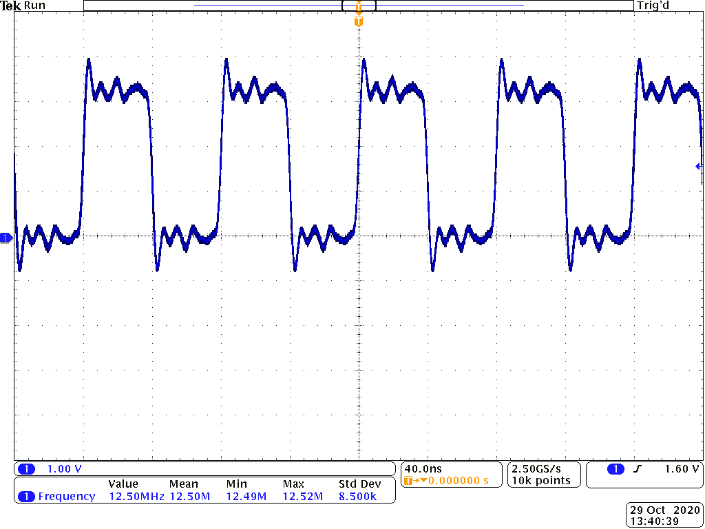

# Homework 8
Table 1: Frequency Comparison
|   | Frequency |
|---|---|
| ARM GPIO | 12.5 MHz |
| PRU | 66 MHz |

## Blinking an LED
`make start` will start the PRU and `make stop` will stop the PRU.
It is running at 12.5 MHz.
It is a jittery function. There is a lot of overshoot on the square wave when it transitions from high to low.

Figure 1: Toggling P9_31 as fast as possible using ARM GPIO

## PWM Generator
The PRU is able to oscillate at 66.6MHz, which is much faster than the ARM GPIO is able to.

# hw08 grading

| Points      | Description | |
| ----------- | ----------- |-|
| 10/14 | PRU | *Some more details would be nice.*
|  0/2 | Controlling the PWM Frequency - optional
|  0/2 | Reading an Input at Regular Intervals - optional
|  0/2 | Analog Wave Generator - optional
| 10/20 | **Total**

*My comments are in italics. --may*
